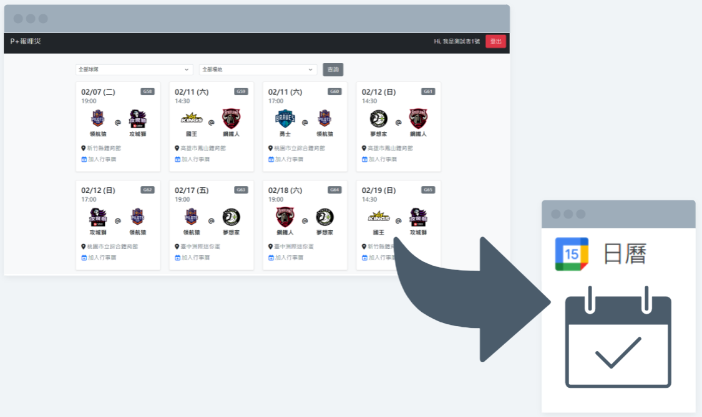
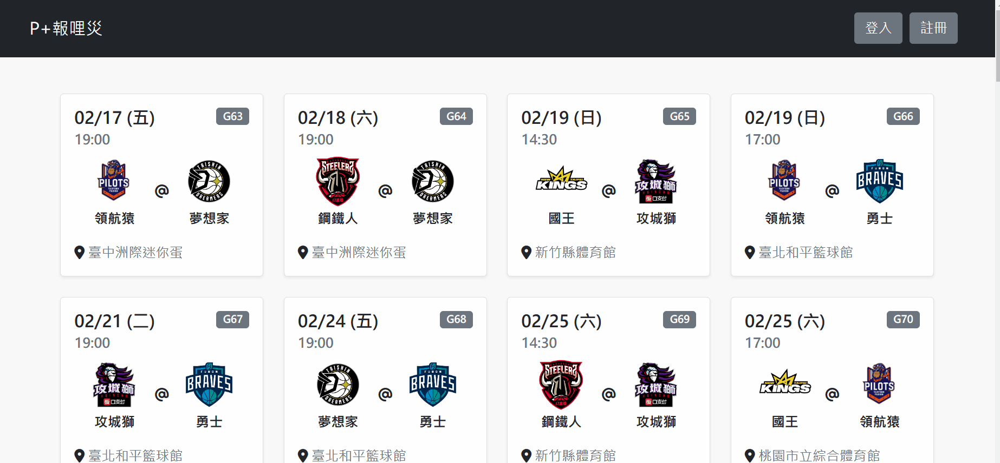
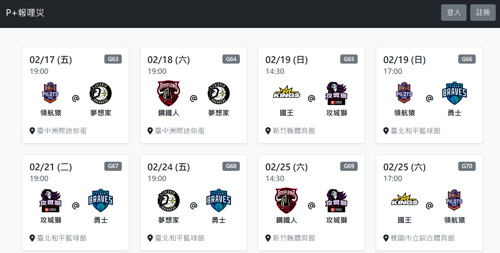
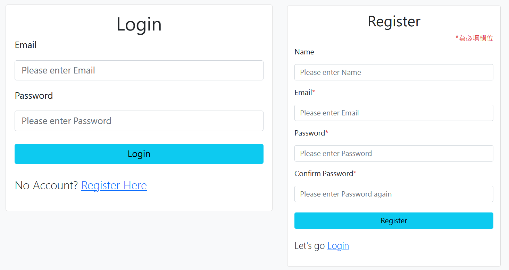
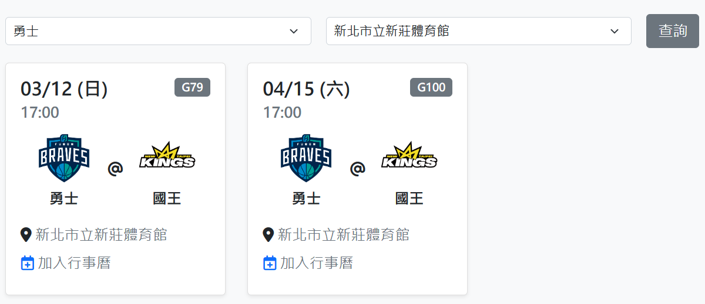
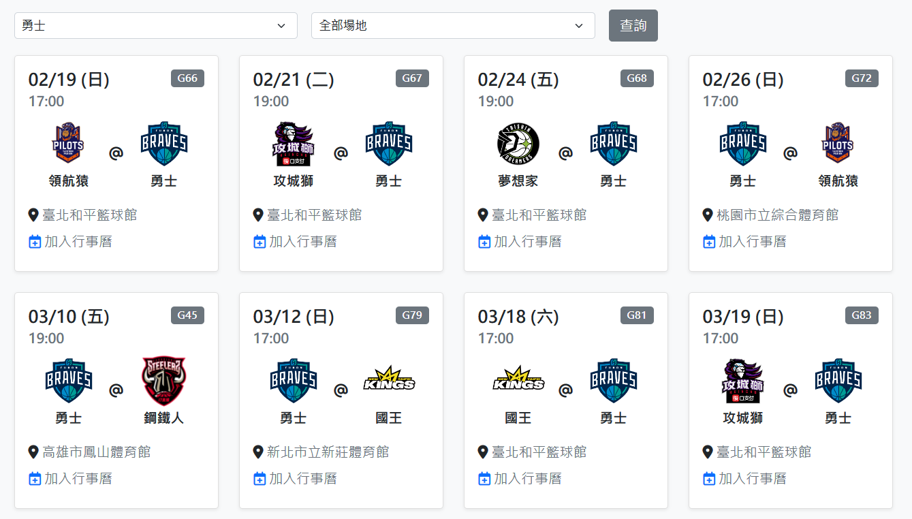
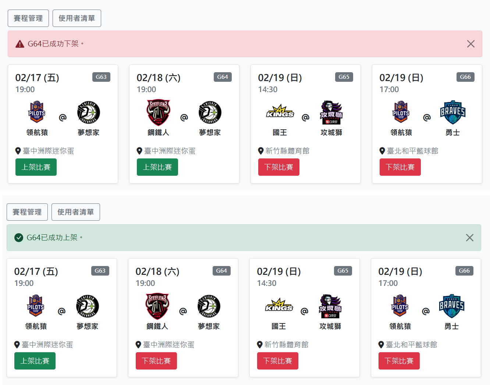
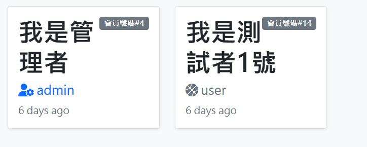

# P+報哩災
## 網站入口：[P+報哩災](https://plusleague.herokuapp.com/)

P+報哩災為使用Node.js、Express、Handlebars、MySQL打造的1人全端專案，提供國內職籃Plus League賽程資訊，會員可透過Oauth2.0授權將賽程加入個人google行事曆，並提供後台提供上、下架對戰服務。

### 添加賽程至個人行事曆


### 首頁


### 登入與註冊


### 依球隊與比賽地點篩選



### 後台管理 - 賽程上下架


### 後台管理 - 使用者清單


## 測試帳號
### 前台

**`為方便demo，測試帳號已與特定google帳號連結，若需加入個人google行事曆服務，請註冊新會員並透過Oauth2.0授權後方可使用)`**

``` 
帳號: user1@example.com
密碼: 123
```
### 後台(前台僅有瀏覽權限)
```
帳號: admin@example.com
密碼: 123
```

## 功能介紹
### 賽程來源
+ 使用axios與cheerio套件與P+官網介接爬蟲取得。

(考量權限與網路爬蟲道德，目前無定期爬蟲，透過本地端運行爬蟲程式一次抓取賽程資訊後以JSON格式保存，再透過種子資料migrate至資料庫。)
### 登入及註冊
+ 使用者註冊及登入功能(flash message提示錯誤訊息)。
+ 使用bcrypt儲存使用者密碼。
+ 使用passport實作登入驗證。
+ 登入後，使用cookie實作JWT權限驗證。
### 前台 - 使用者權限功能
+ 可透過球隊或比賽場館篩選對戰
+ 授權Oauth2.0後，可將賽程加入個人google行事曆中。(Oauth2.0授權+JWT存取google token實作)
+ 可點選logout登出使用狀態。
### 後台 - 管理者權限功能
+ 可上/下架賽程(下架後，前台不顯示直至重新上架)
+ 瀏覽全部註冊的使用者清單

## 安裝執行
### 安裝執行應用程式
1. 確認安裝node.js & npm。
2. 開啟Terminal將專案 clone 至本地位置：
```
git clone https://github.com/Gincoolwant/plusleague.git
```
3. 進入專案資料夾
```
cd plusleague
```
4. 安裝使用套件： 
```
npm install
```
5. 設定環境變數，新增.env檔案(內容請參考.env example)：
```
GOOGLE_CLIENT_ID = #your Google Cloud console OAuth2.0 id
GOOGLE_CLIENT_SECRET = #your Google Cloud console OAuth2.0 secret
GOOGLE_REDIRECT_URL = #Google Cloud console OAuth2 redirect url, ex:http://localhost:3000/auth/google/callback
SESSION_SECRET = #session secret for passport(local) authenticate
JWT_SECRET = #your jwt secret for passport(jwt) authenticate
PORT = #local port allowed, default:3000
```
6. 建立MySQL DB取名為plus_league(以MySQL Workbench為例)
```
create database plus_league;
```
7. 設定資料庫config
```
開啟config.json修改
"development": {
    "username": "", // 輸入local端MySQL帳號
    "password": "", // 輸入local端MySQL密碼
    "database": "plus_league",
    "host": "127.0.0.1",
    "dialect": "mysql"
  }
```
8. 建立Schema
```
npx sequelize db:migrate
```
9. 寫入種子資料
```
npx sequelize db:seed:all
```
6. 執行專案：
```
npm run start
```

成功連線時，終端機會看見訊息： `App is listening on port 3000!`，請開啟瀏覽器輸入網址 http://localhost:3000 進入首頁。
### 爬蟲
若需重新抓取官網賽程資訊，請執行crawler.js腳本
```
node ./crawler/crawler.js
```
並更新資料庫
```
npx sequelize db:seed --name 20230117111427-matches-seed-file
```


## 開發環境與工具
+ [Visual Studio Code](https://visualstudio.microsoft.com/zh-hant/)
+ [Node.js](https://nodejs.org/en/)
+ [Express](https://www.npmjs.com/package/express)
+ [MySQL](https://www.mysql.com/)
+ [Sequelize](https://sequelize.org/)
+ [googleapis](https://www.npmjs.com/package/googleapis)
+ [dayjs](https://day.js.org/en/)
+ [passport](https://www.npmjs.com/package/passport)
+ [passport-local](https://www.passportjs.org/packages/passport-local/)
+ [passport-jwt](https://www.passportjs.org/packages/passport-jwt/)
+ [Express-Handlebars](https://www.npmjs.com/package/express-handlebars)
+ [Bootstrap](https://getbootstrap.com/)
+ [Font-awesome](https://fontawesome.com/)
+ [Method-override](https://www.npmjs.com/package/method-override)
+ [bcryptjs](https://www.npmjs.com/package/bcryptjs)
+ [bootstrap-icons](https://icons.getbootstrap.com/)
+ [connect-flash](https://www.npmjs.com/package/connect-flash)
+ [dotenv](https://www.npmjs.com/package/dotenv)
+ [express-session](https://www.npmjs.com/package/express-session)


## 開發人員
+ [CK](https://github.com/Gincoolwant)
+ E-Mail： soulbox790326@gmail.com
